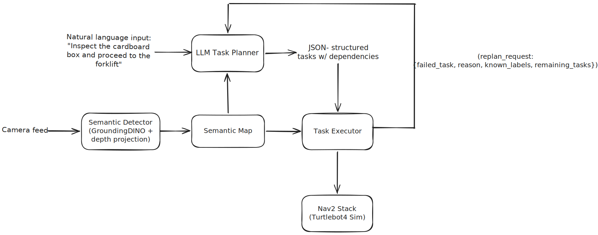

# NaturalNav Architecture

## Scope
Natural language-conditioned semantic navigation in structured indoor simulation

## System Design

## Components

### LLM Task Planner
Converts plain natural language input string to a JSON-structured task list with dependency tracking. The planner is provider-agnostic (calls 'get_client(provider, ...)' with provider set as a configurable parameter with ollama running as default). It also implements a state-driven execution constantly tracking '_pending_replan_context' and '_known_labels' across calls.

**Interfaces:** subscribes to '/natural_nav/command', '/natural_nav/semantic_map', '/natural_nav/replan_request'; publishes '/natural_nav/task_graph' and '/natural_nav/planner_status'

### Semantic Detector
Runs GroundingDINO on the OAK-D RGB image feed at 2 Hz inference / 1 Hz map publish using the following open-vocab prompt list (shelf, pallet, box, cardboard box, person, chair, table, forklift, door, barrel). 

This is the pipeline per detection: bbox center pixel -> sample depth from aligned depth image -> unproject 3D via camera intrinsics -> TF-transform: camera frame -> map frame -> update in-memory 'SemanticMap'

Depth is sampled at the depth image's own resolution, which can differ from the RGB feed's, then unprojected using the RGB/camera_info intrinsics rather than the depth-scaled coordinates - the pixel scaling between the two resolutions ('scale_pixel') is handled explicitly since mixing them up silently produces wrong 3D points.

TF lookup uses rclpy.time.Time() (zero-stamp = "latest available") especially to dodge sim-time/wall-time races. 

**Interfaces:** subscribes to '/rgbd_camera/image', '/rgbd_camera/depth_image', '/rgbd_camera/camera_info', TF (oakd_rgb_camera_optical_frame → map); publishes '/natural_nav/semantic_map' (1 Hz snapshot) and '/natural_nav/detections'

### Semantic Map
This is an in-memory Python class (SemanticMap) not a separate ROS node, instantiated independently inside the Semantic Detector (writer) and both the LLM task planner and task executor (readers), kept in sync purely via the '/natural_nav/semantic_map' JSON pub/sub not shared memory.

Each label keeps a ring buffer of up to 10 recent observations ((x, y, confidence)); canonical pose is a confidence-weighted running mean, not just the latest sighting. Exposes exact 'lookup()' and 'fuzzy_lookup()' (substring/word overlap match, highest confidence candidate wins).

### Task Executor
Dispatches the LLM-generated task list to the robot, one task at a time, respecting declared dependencies ('is_ready()' checks that all upstream tasks succeeded before a task becomes eligible for dispatch; among ready tasks, priority then id breaks ties).

For each dispatched task, the target label is resolved against the live Semantic Map - exact lookup first, falling back to fuzzy match (eg. "the box" -> "cardboard_box_1") and turned into a Nav2 'NavigateToPose' goal. 

Three conditions trigger a replan request rather than a hard stop/ failure: unresolvable target, Nav2 goal rejection, or Nav2 non-success terminal status. 

On any of these, '_request_replan()' publishes a JSON payload - the failed task, its failure reason, currently known semantic-map labels, and the remaining task queue on the '/natural_nav/replan_request' topic, which the LLM task planner subscribes to and folds into its next prompt as replan context.

**Interfaces:** subscribes to '/natural_nav/task_graph' (planner output) & '/natural_nav/semantic_map', publishes '/natural_nav/replan_request' and '/natural_nav/fleet_status'; implements a Nav2 'NavigateToPose' action client.

### Nav2 Stack
Thin wrapper (simulation.launch.py) around 'nav2_bringup tb4_simulation_launch.py', so it rides the maintained reference stack. Runs Gazebo + Turtlebot4 + full Nav2 (planner, controller, localization) + RViz2 in the 'nav2_minimal_tb4_sim' warehouse world with a pre-built occupancy grid. 

**Interfaces:** exposes '/navigate_to_pose' action server (consumed by Task Executor); camera topics '/rgbd_camera/image', '/rgbd_camera/depth_image', '/rgbd_camera/camera_info' at ~10 Hz originate from here.

## Inputs

- Natural-language command - currently a manually published string on '/natural_nav/command', a stand-in for the intended audio/speech-to-text input path.
- Camera feed (RGB + depth) - currently the TB4's OAK-D in Gazebo sim, but treated as sensor-agnostic since the modality will change with the robot platform (eg. humanoid/quadruped later).

## Outputs

- Robot physical motion/navigation - the actual outcome of dispatched Nav2 '/navigate_to_pose' goals.
- Status telemetry - '/natural_nav/fleet_status' and '/natural_nav/planner_status' for external observability.
- Semantic map snapshot - '/natural_nav/semantic_map' (JSON), exposing the robot's current world-model; planned: also publish an RViz2 MarkerArray (tracked in [#9](https://github.com/adharshvenkat/natural_nav/issues/9)), treated as a demo/presentation-facing output, not only an internal debugging aid.

## Assumptions

- Pre-built, Nav2-compatible map of the environment exists - no SLAM/online mapping; the robot localizes against a known warehouse map rather than building one.
- Detection vocabulary is fixed at launch (static prompt list: shelf, pallet, box, cardboard box, person, chair, table, forklift, door, barrel), not dynamically derived from the task command.

## Known Failure Modes

- Unresolved target has no reliable failure signal today. By design, the planner should return 'no matching target' ('replan_on_failure: false', no recovery attempted) when a command references a label outside 'known_labels'. In practice this isn't enforced in code - '_parse_json()' publishes whatever JSON the LLM returns with no validation against 'known_labels' - and the local model has been observed substituting a different, wrong-but-known label instead (see [#8](https://github.com/adharshvenkat/natural_nav/issues/8)). The robot can then confidently navigate to the wrong object with no visible error, which is worse than a clean failure.
- No active-search/exploration behavior exists. The semantic map is only populated by passive observation while driving; if a target hasn't been seen yet (or falls outside the static detection vocabulary, see Assumptions), there's no fallback to go look for it - the planner's own fallback message says "explore first" but no explore behavior is implemented. Fixing both of these (label validation + dynamic vocab + active search) is planned future work, tracked in [#8](https://github.com/adharshvenkat/natural_nav/issues/8) and [#12](https://github.com/adharshvenkat/natural_nav/issues/12).

